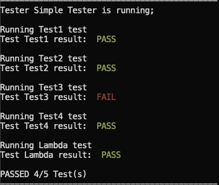
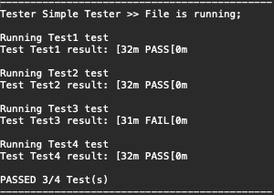

# CPP_SimpleTest
A header only, simple testing helper for all projects.

## REQUIREMENTS:

- C++ 11 or later

## GOAL

- Allow the user to create functions which **must return a boolean**
but may accept **any type** and **any number** of arguments

- These tests are then registered, and can be run in order

- Output strean is **specified when the Tester object is constructed**

- ***NOTE:*** The Tester object is in namespace ST (SimpleTester)

## USAGE:

Pre-defined Tests:
```cpp
#include "SimpleTester.hpp"

bool simpleTest() {
    return 5 == 5;
}

// CORE FEATURE: Any number of parameters
bool exampleTest(int a, int b) {
    return a == b;
}
```

Output into Terminal:
```cpp
int terminalOutput() {
    ST::Tester theTester{"Tester Name"}; // automatically prints output to std::cout

    //theTester.registerTest("Test Name", function*, arguments...)
    theTester.registerTest("Simple", simpleTest); // no arguments needed
    theTester.registerTest("Example", exampleTest, 5, 5);

    theTester.runTests();
    return 0;
}
```



Output into File:
```cpp
#include <fstream>

int fileOutput() {
    std::ofstream aFile{"path/to/file.ext"};
    ST::Tester theTester{"Tester Name", aFile}; 

    //theTester.registerTest("Test Name", function*, arguments...)
    theTester.registerTest("Simple", simpleTest); // no arguments needed
    theTester.registerTest("Example", exampleTest, 5, 5); // exactly two arguments must be provided

    theTester.runTests();
    return 0;
}
```


## TEST GROUPS:

Groups are done using different Tester objects

```cpp
ST::Tester group1{"Group 1"};
ST::Tester group2{"Group 2"};
// ...
```

## CONTRIBUTIONS:

**Contributions are Welcome!**

Flexability is at the core of this tool, therefore the usual utilities do not exist.

```cpp
assert(BOOLEAN_OPERATION)
```

Because they can be made in the form of a general function like:

```cpp
theTester.registerTest("Assert Test", []()-> bool {return BOOLEAN_OPERATION});
```

This makes the system easier to compose and extend.

Feel free to define any macros you would like for ease of use.
